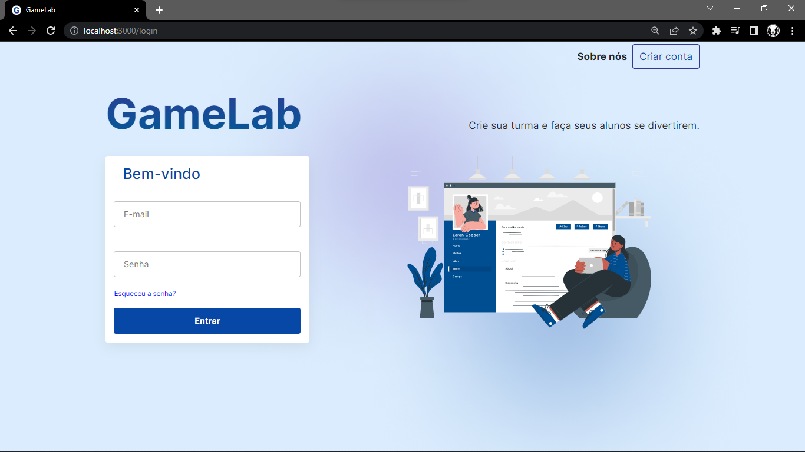
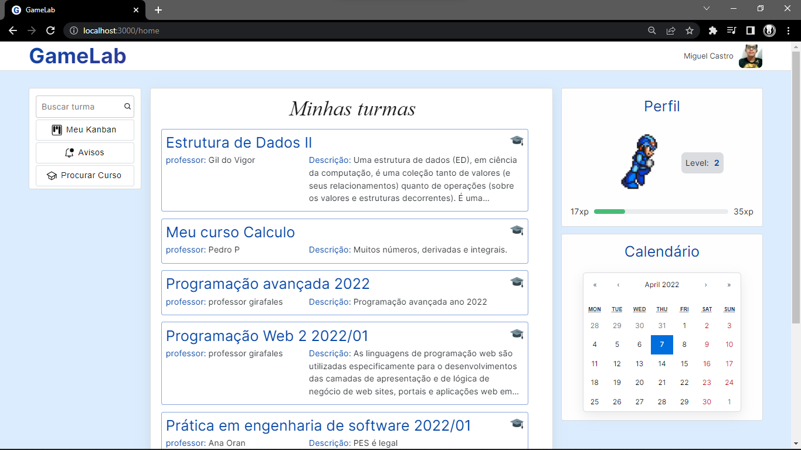

# GameLab: Plataforma de Aprendizado Gamificado
## Visão Geral
Bem-vindo ao repositório do GameLab, uma plataforma inovadora de apoio à aprendizagem que combina gerenciamento eficiente de conteúdo educacional com os princípios de gamificação. Projetado tanto para professores quanto para alunos, o GameLab facilita a criação, distribuição, submissão e avaliação de trabalhos, tornando o processo de ensino-aprendizagem mais envolvente e eficaz.

## Características Principais
- Gerenciamento de Conteúdo: Facilita a organização e o acesso a materiais de curso, trabalhos e recursos didáticos.
- Elementos de Gamificação: Integra mecânicas de jogos para aumentar o engajamento e a motivação dos alunos, incluindo elementos gráficos interativos.
- Ferramenta Kanban Integrada: Implementa uma funcionalidade de Kanban para ajudar na gestão de tarefas e atividades, beneficiando tanto professores quanto alunos na organização de suas responsabilidades e prazos.
- Interface Intuitiva: Uma plataforma amigável e fácil de usar, tornando a experiência de aprendizado mais acessível e agradável.
Benefícios
- Aumento do Engajamento dos Alunos: A gamificação ajuda a manter os alunos motivados e interessados no conteúdo do curso.
- Eficiência no Ensino: Professores podem gerenciar cursos e avaliações de forma mais eficiente, proporcionando feedback oportuno e relevante.
- Melhoria na Organização: A funcionalidade do Kanban auxilia na organização de tarefas e no cumprimento de prazos.
Para Professores e Alunos

O GameLab é ideal para professores que buscam uma plataforma versátil para gerenciar seus cursos e para alunos que desejam uma ferramenta interativa e envolvente para auxiliar em seus estudos.

## Contribua
Este projeto está aberto a contribuições da comunidade. Se você tem ideias para novas funcionalidades, melhorias ou correções, sinta-se à vontade para colaborar.

Disponivel em: https://aesthetic-biscotti-6531ca.netlify.app/

